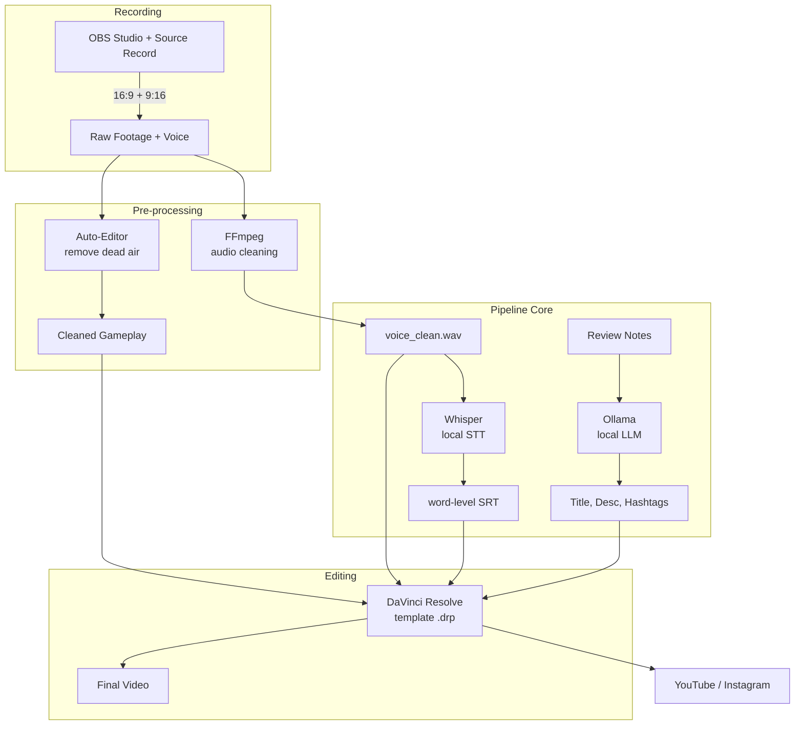

# Game Review Pipeline – Design Document

## 1. Introduction
The Game Review Pipeline automates the tedious pre‑edit phase of producing gaming review videos. It takes raw gameplay recordings and voiceover, then outputs cleaned audio, word‑level captions, metadata, and a ready‑to‑edit DaVinci Resolve project. The entire stack is built from **free and open‑source tools**, requiring no subscription, no cloud dependencies (optional), and no feature‑locked software.

### Goals
- Reduce editing time by **70–90%**.
- Provide a **CLI‑first** experience that can run on any machine with minimal setup.
- Remain **modular** – every component (captions, metadata, editor) can be replaced independently.
- Use **only free software** for both the pipeline and the video production stack.

---

## 2. High‑Level Architecture

The pipeline is composed of **command‑line utilities** (Python + external tools) that process files sequentially. The `pipeline` CLI orchestrates them.

---

## 3. Components

### 3.1 CLI (`automation/cli.py`)
- **Framework:** [Typer](https://typer.tiangolo.com/)
- **Commands:**
  - `run` – full pre‑edit pipeline (folder setup → audio → captions)
  - `audio` – clean a voiceover file with FFmpeg
  - `captions` – generate word‑level SRT using Whisper
  - `metadata` – produce title/description/hashtags from a review script (via LLM)
  - `folder` – create the standard project directory structure
  - `watch` – monitor a folder and automatically run the pipeline
- **Design choice:** Heavy dependencies (Whisper, LLM clients) are **lazy‑loaded** inside the command functions. This keeps `pipeline folder` and `pipeline audio` usable even if AI modules are not installed.

### 3.2 Configuration (`config/default.yaml`)
- Central config file defines folder names, FFmpeg filter chain, Whisper model, and watcher settings.
- Users can override with a custom `--config-path`.

### 3.3 Audio Processing (`automation/audio.py`)
- Uses **FFmpeg** (`ffmpeg-python` wrapper) to apply a filter chain:
  - High‑pass (80 Hz) and low‑pass (8 kHz) for noise reduction.
  - `compand` for dynamic range compression and loudness normalisation.
  - `alimiter` to prevent clipping.
- Output is a clean 16‑bit WAV file ready for Resolve.

### 3.4 Caption Generation (`automation/captions.py`)
- Uses **OpenAI Whisper** (`base` model by default) running **entirely locally**.
- Transcribes the cleaned voiceover with word‑level timestamps.
- Produces an **SRT file** where each subtitle is a single word – this enables word‑by‑word animation in Resolve.

### 3.5 Metadata Generation (`automation/metadata.py`)
- Supports multiple LLM backends:
  - **OpenAI** (via `openai` library) – requires API key.
  - **Gemini** (via `google-generativeai`)
  - **Claude** (via `anthropic`)
  - **Ollama** (local, free, no internet needed) – the default.
- Sends a prompt containing the user’s review bullet points and expects a JSON with `title`, `description`, and `hashtags`.
- The prompt is strictly formulated to avoid hallucination and return valid JSON.

### 3.6 Folder Watcher (`automation/watcher.py`)
- Uses **Watchdog** to monitor a directory for new video files.
- When a new recording appears, it looks for a matching voiceover file (same name, `.wav` extension) and optionally launches the full pipeline automatically.
- Gracefully exits if no `watch_folder` is configured.

### 3.7 Plugin System (`plugins/`)
- Any `.py` file in `plugins/` that exposes a `run(stage, **kwargs)` function is automatically loaded.
- The pipeline calls these hooks after each major stage (audio cleaning, captions, etc.), allowing users to add custom notifications, logging, or additional processing without touching the core code.

---

## 4. Data Flow
1. **Recording:** OBS produces raw gameplay (16:9 and 9:16) and a separate voiceover `.wav`.
2. **Pre‑processing (optional but recommended):** [Auto‑Editor](https://auto-editor.com/) removes silent / low‑activity parts from the gameplay footage.
3. **Pipeline execution:** `pipeline run` creates the project folder structure, cleans the voiceover via FFmpeg, and (if Whisper is installed) generates word‑level captions.
4. **Metadata generation:** `pipeline metadata` takes a text file of review notes and returns a JSON with title, description, and hashtags.
5. **Editing:** The user opens a pre‑built DaVinci Resolve template, replaces placeholders with cleaned media, imports the SRT captions, and tweaks the edit.
6. **Export & Upload:** The rendered video is uploaded with the generated metadata.

All file paths and naming conventions are standardised so that the entire flow can be scripted.

---

## 5. Technology Stack (All Free & Open‑Source)

| Category               | Tool                           | License      | Why it’s chosen                                                       |
|------------------------|---------------------------------|--------------|-----------------------------------------------------------------------|
| Game capture           | OBS Studio + Source Record     | GPLv2 / MIT  | Industry standard, dual recording, free                              |
| Dead‑air removal       | Auto‑Editor                     | MIT          | Fast, simple CLI, removes silences                                    |
| Audio cleaning         | FFmpeg                          | LGPL/GPL     | Battle‑tested, scriptable, no GUI needed                             |
| Voice cleaning (alt)   | Audacity macro                  | GPLv2        | Optional GUI‑based alternative                                        |
| Caption generation     | OpenAI Whisper (local)          | MIT          | State‑of‑the‑art speech‑to‑text, runs offline, free                  |
| Metadata generation    | Ollama + Llama 3 / Mistral      | MIT/Apache   | Completely local, no API costs, privacy‑friendly                     |
| Video editing          | DaVinci Resolve (Free version)  | Proprietary  | No watermark, full feature set, industry‑grade                        |
| Thumbnail creation     | Canva (free tier) / GIMP       | Freemium/GPL | Easy to use, sufficient for YouTube/Instagram                        |
| Music & SFX            | Pixabay, YouTube Audio Library  | Royalty‑free | Free for commercial use                                               |
| Version control        | Git + GitHub                    | GPL/Free     | Standard open‑source collaboration                                    |
| Build system           | Hatchling                       | MIT          | Modern Python packaging                                               |
| Automation engine      | Python 3.10+                    | PSF          | Cross‑platform, vast ecosystem, easy to extend                        |

**No part of the pipeline requires a paid license or subscription.** All AI models run locally (Whisper, Ollama), preserving privacy and avoiding API fees.

---

## 6. Design Decisions & Rationale

### 6.1 Modular, Replaceable Components
Every stage (audio, captions, metadata, editing) is a separate module. Users can swap Whisper for Deepgram, Resolve for Premiere, or Ollama for GPT‑4 without rewriting the entire pipeline. The plugin system further enables custom extensions.

### 6.2 Lazy Imports for Heavy Dependencies
Whisper and LLM libraries are imported only when the corresponding command is invoked. This allows basic commands (`folder`, `audio`, `watch`) to function immediately after installation, without requiring the user to install large AI packages.

### 6.3 Configuration‑Driven
All folder names, filter settings, model names, and watcher behaviour are stored in a single YAML file. This eliminates hard‑coded values and makes the pipeline adaptable to different workflows (e.g., different naming conventions, different languages).

### 6.4 Offline‑First Mentality
The recommended setup uses **Ollama** for metadata and **Whisper** for captions – both run entirely on the user’s machine. This protects sensitive review content and eliminates recurring costs.

### 6.5 DaVinci Resolve as the Editing Backbone
Resolve Free offers professional colour grading, Fusion compositing, and Fairlight audio – all without watermarks or time limits. The template approach ensures consistent branding and reduces repetitive setup.

---

## 7. Security & Privacy
- The pipeline processes all data **locally**. No audio, video, or review text is sent to external servers unless the user explicitly chooses a cloud LLM (OpenAI, Gemini, Claude).
- API keys (if used) are expected to be provided via environment variables or command‑line flags, never hard‑coded.
- Generated captions and metadata are stored in plain text files, giving the user full control over their content.

---

## 8. Deployment & Getting Started
1. **Clone the repo** and create a virtual environment.
2. Install the core package: `pip install -e .`
3. For captions and metadata, install the optional dependencies: `pip install -e ".[ollama]"` (and/or `openai-whisper`).
4. Run `pipeline --help` to see available commands.
5. Follow the **[Full Workflow Guide](full-workflow.md)** for a step‑by‑step walkthrough.

---

## 9. Future Roadmap
- **AI highlight detection:** Automatically select the most exciting gameplay moments using a computer‑vision model.
- **GUI:** A simple desktop wrapper (Electron / Tauri) for users uncomfortable with the command line.
- **Multi‑editor support:** Templates for Premiere Pro, CapCut, and Kdenlive.
- **Cloud sync:** Optional integration with cloud storage to back up projects.
- **Analytics dashboard:** Track time saved, render statistics, and upload performance.

---

## 10. Contributing
Contributions are welcome! See the repository’s `CONTRIBUTING.md` (if available) or open an issue to discuss ideas. The plugin system is the easiest way to add functionality without modifying the core.

---

*This document reflects the architecture as of version 0.1.0 and will be updated as the project evolves.*
